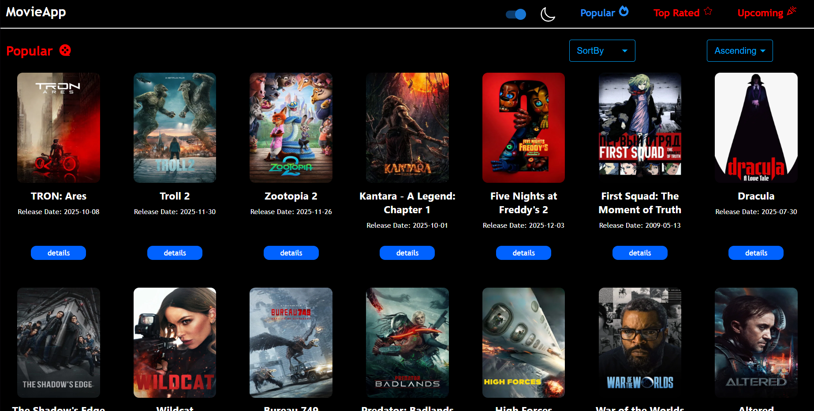

# 🎬 Movie App

Kullanıcıların popüler ve güncel filmleri listeleyebildiği, film detaylarını inceleyebildiği bir web uygulaması.

Bu proje React, TypeScript ve Redux Toolkit kullanarak frontend yeteneklerimi geliştirmek amacıyla hazırlanmıştır.

---

## 🛠️ Kullanılan Teknolojiler

- React
- TypeScript
- Redux Toolkit
- React Router
- REST API (Film verileri)
- CSS (hangisini kullandıysan)

---

## ✨ Özellikler

- 🎥 Popüler filmleri listeleme
- 🔍 Film detay sayfası
- ⭐ Puan, açıklama ve çıkış tarihi görüntüleme
- ⚡ Redux Toolkit ile global state yönetimi
- 📱 Responsive tasarım

---

## 📸 Ekran Görüntüleri


<!-- varsa başka ss'leri de ekleyebilirsin -->

---

## ⚙️ Kurulum ve Çalıştırma

```bash
# Repoyu klonla
git clone https://github.com/serkanoztas/movie-app.git

# Proje klasörüne gir
cd movie-app

# Bağımlılıkları yükle
npm install

# Projeyi çalıştır
npm start
